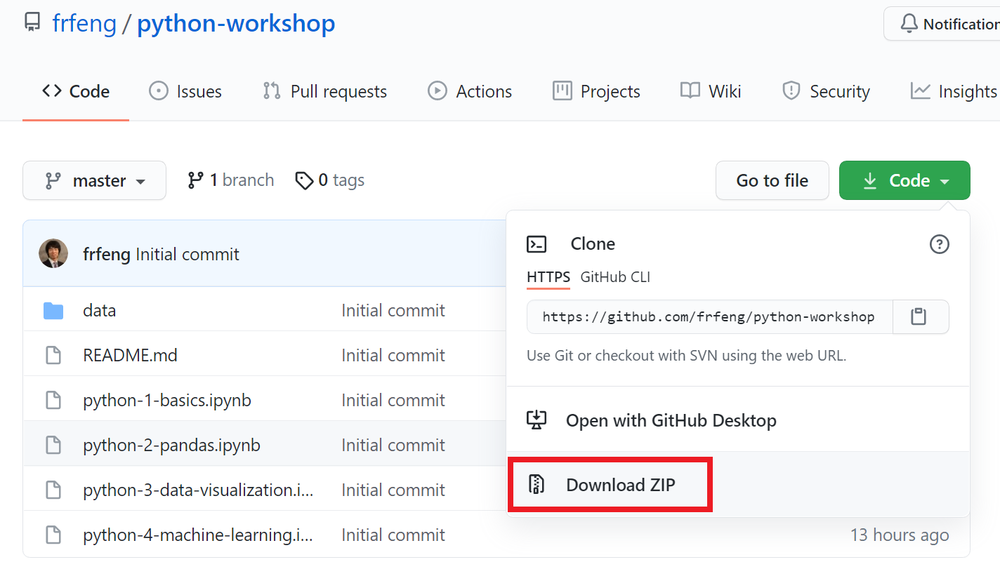

# Workshop: Introduction to data analysis in Python

## Topics

- Python basics
- Data analysis with [pandas](https://pandas.pydata.org/)
- Data visualization with [matplotlib](https://matplotlib.org/)
- Machine learning with [scikit-learn](https://scikit-learn.org/stable/)

## Tasks *before* attending the workshop

### Task 1. Software installation

First, you need to install Python and Jupyter Notebook, so that you can follow along in this hands-on workshop (and also for future learning). 

[**Software installation instructions**](https://frfeng.github.io/anaconda-install/)

### Task 2. Downloading the Jupyter notebooks and data sets for the workshop

If you know your way around Git and GitHub, you can clone this repository to your local computer. 

```
$ git clone https://github.com/frfeng/python-workshop.git
```

Otherwise, follow the instructions below.

1. Click the **Code ▼** dropdown button, then click **Download ZIP**. 

    

1. This would download everything in this repository as a ZIP file named **python-workshop-master.zip** to your local computer.

1. Unzip the downloaded file, and optionally, move the extracted folder to a desired place on your computer.

### Task 3. Verify that you can open the notebooks in Jupyter Notebook

1. Launch Jupyter Notebook (see the last part of the [software installation instructions](https://frfeng.github.io/anaconda-install/))

    - If you are comfortable with command-line interface, you can first `cd` into the workshop folder, then launch Jupyter by typing in `jupyter notebook`. This would allow you skip the next step.

1. In the Jupyter Notebook Dashboard, navigate into the downloaded folder **python-workshop-master**. 

1. Click any of the notebook files (i.e., the ones with the name extension **.ipynb**) to open it. If it successfully opens, congrats, you are all set!

---
**If you run into any issues, please contact Fred Feng at <fredfeng@umich.edu>**
